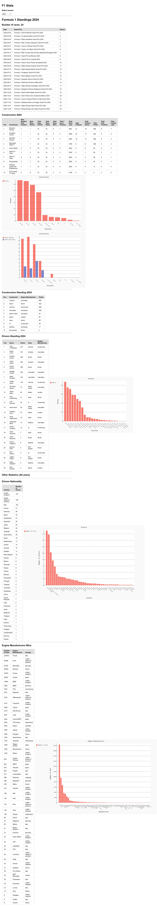

# F1Stats

## My ugly UI F1 statistics!

F1Stats is an open-source project that provides comprehensive statistics and insights into Formula 1 racing, utilizing data from the [F1DB project](https://github.com/f1db/f1db).

## Uses

- **FastAPI**: modern, fast (high-performance), web framework for building APIs with Python based on standard Python type hints. [FastAPI](https://github.com/fastapi/fastapi)
- **Pygal**: a dynamic SVG charting library written in python. All the documentation is on [pygal](https://www.pygal.org/en/stable/).
 Github repository [github](https://github.com/Kozea/pygal)
- **HTML Generator**:A python package to generate HTML from a template which is defined through a tree of render-elements. [htmlgenerator](https://github.com/basxsoftwareassociation/htmlgenerator)
- **htmx**: Interactive web applications using just HTML and minimal JavaScript. [htmx](https://github.com/bigskysoftware/htmx)
- **pure-css**: (just for tables now) A set of small, responsive CSS modules that you can use in every web project. [pure-css](https://github.com/pure-css/pure/)

## Features

- **Comprehensive Data**: Access detailed information on drivers, teams, circuits, and race results.
- **Historical Insights**: Analyze historical performance trends and statistics.
- **User-Friendly Interface**: Navigate through data with an intuitive and responsive design.

## Installation

To set up the F1Stats application locally, follow these steps:

1. **Clone the Repository**:

   ```bash
   git clone https://github.com/jsoques/f1stats.git
   cd f1stats
   ```

2. **Set Up a Virtual Environment**:

   ```bash
   python3 -m venv venv
   source venv/bin/activate
   ```

3. **Install Dependencies**:

   ```bash
   pip install -r requirements.txt
   ```

4. **Download F1 database**:

    ```bash
    cd datastore
    wget https://github.com/f1db/f1db/releases/download/v2025.0.4/f1db-sqlite.zip
    uz f1db-sqlite.zip
    cd ..
    ```

5. **Run the Application**:

   ```bash
   uvicorn app.main:app --port 8888 --host 0.0.0.0 --loop uvloop --reload
   ```

   The application will be accessible at `http://localhost:8888`.

## Usage

Once the application is running, you can:

- **Select a year**: Race results for the season and other historic statistics (WIP).

## Screenshot



## Contributing

We welcome contributions to enhance F1Stats. To contribute:

1. **Fork the Repository**: Click the "Fork" button at the top right of this page.
2. **Create a New Branch**: Use a descriptive name for your branch.

   ```bash
   git checkout -b feature/your-feature-name
   ```

3. **Make Your Changes**: Implement your feature or fix.
4. **Commit Your Changes**: Write clear and concise commit messages.

   ```bash
   git commit -m "Add feature: your-feature-name"
   ```

5. **Push to Your Fork**:

   ```bash
   git push origin feature/your-feature-name
   ```

6. **Submit a Pull Request**: Navigate to the original repository and open a pull request with a detailed description of your changes.

## License

Permission is hereby granted, free of charge, to any person obtaining a copy of this software and associated documentation files (the “Software”), to deal in the Software without restriction, including without limitation the rights to use, copy, modify, merge, publish, distribute, sublicense, and/or sell copies of the Software, and to permit persons to whom the Software is furnished to do so, subject to the following conditions:

The above copyright notice and this permission notice shall be included in all copies or substantial portions of the Software.

THE SOFTWARE IS PROVIDED “AS IS”, WITHOUT WARRANTY OF ANY KIND, EXPRESS OR IMPLIED, INCLUDING BUT NOT LIMITED TO THE WARRANTIES OF MERCHANTABILITY, FITNESS FOR A PARTICULAR PURPOSE AND NONINFRINGEMENT. IN NO EVENT SHALL THE AUTHORS OR COPYRIGHT HOLDERS BE LIABLE FOR ANY CLAIM, DAMAGES OR OTHER LIABILITY, WHETHER IN AN ACTION OF CONTRACT, TORT OR OTHERWISE, ARISING FROM, OUT OF OR IN CONNECTION WITH THE SOFTWARE OR THE USE OR OTHER DEALINGS IN THE SOFTWARE.

## Acknowledgements

Special thanks to the [F1DB project](https://github.com/f1db/f1db) for providing the comprehensive dataset that powers this application.
